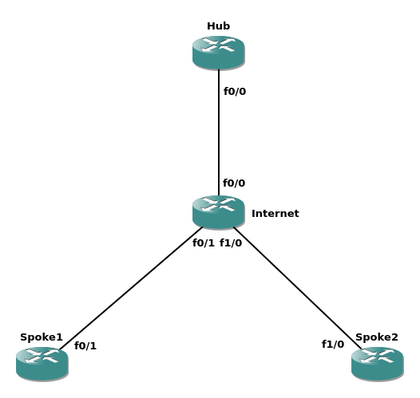
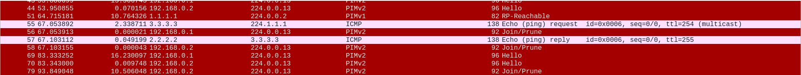
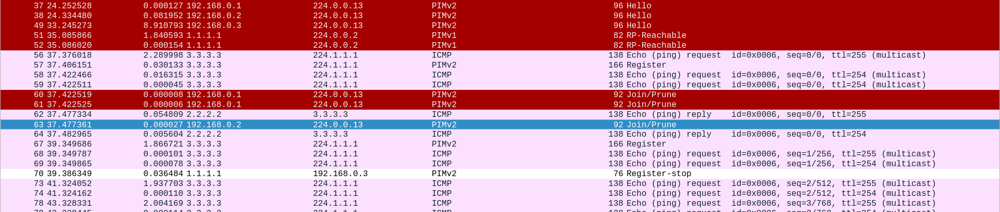

# Introduction
There are quite a few Configuration Guides and articles in the Internet that provide detailed explanation of DMVPN setup and operation. However,  did not shed any light on details of the process.
> *“In DMVPN, it is recommended to configure a Rendezvous Point (RP) at or behind the hub. If there is an IP multicast source behind a spoke, the ip pim spt-threshold infinity command must be configured on spokes to avoid multicast traffic going through spoke-to-spoke tunnels.”*

# Topology
Let’s try to find out what this restriction is about. Here is our lab topology:
  
Just an ordinary DMVPN Phase 2 lab in GNS3. Loobacks on every router are used for emulating adjacent client LANs; also, RP is somewhat sensible to be placed on the Hub. For addressing, I consider: Hub = R1, Spoke1 = R2, Spoke2 = R3, Internet = R4.

# Configuration
Let’s enable PIM in the overlay on every DMVPN router and configure RP:

#### R1
```shell
interface Loopback0
 ip address 1.1.1.1 255.255.255.255
 ip pim sparse-mode
interface Tunnel0
 ip address 192.168.0.1 255.255.255.0
 no ip redirects
 no ip split-horizon eigrp 1
 ip pim sparse-mode
 ip nhrp map multicast dynamic
 ip nhrp network-id 1
 tunnel source FastEthernet0/0
 tunnel mode gre multipoint
 tunnel vrf A
ip pim rp-address 1.1.1.1
```
#### R2
```shell
interface Loopback0
 ip address 2.2.2.2 255.255.255.255
 ip pim sparse-mode
interface Tunnel0
 ip address 192.168.0.2 255.255.255.0
 no ip redirects
 ip pim sparse-mode
 ip nhrp network-id 1
 ip nhrp nhs 192.168.0.1 nbma 192.168.14.1 multicast
 tunnel source FastEthernet0/1
 tunnel mode gre multipoint
 tunnel vrf A
ip pim rp-address 1.1.1.1
```

#### R3
```shell
interface Loopback0
 ip address 3.3.3.3 255.255.255.255
 ip pim sparse-mode
interface Tunnel0
 ip address 192.168.0.3 255.255.255.0
 no ip redirects
 ip pim sparse-mode
 ip nhrp network-id 1
 ip nhrp nhs 192.168.0.1 nbma 192.168.14.1 multicast
 tunnel source FastEthernet1/0
 tunnel mode gre multipoint
 tunnel vrf A
ip pim rp-address 1.1.1.1
```

Everything looks good so far, we are ready to subscribe for multicast on Spoke1:

```shell
Spoke1(config)#int lo 0
Spoke1(config-if)#ip igmp join-group 224.1.1.1
Spoke1#sho ip mroute
<output omitted>
(*, 224.1.1.1), 00:00:37/00:02:22, RP 1.1.1.1, flags: SJCL
  Incoming interface: Tunnel0, RPF nbr 192.168.0.1
  Outgoing interface list:
    Loopback0, Forward/Sparse, 00:00:37/00:02:22
```

Now it’s time to start streaming from Spoke2:
```shell
Spoke2#ping 224.1.1.1 source lo0 rep 1000
Type escape sequence to abort.
Sending 1000, 100-byte ICMP Echos to 224.1.1.1, timeout is 2 seconds:
Packet sent with a source address of 3.3.3.3 

Reply to request 0 from 2.2.2.2, 156 ms..…
```

Oops. It seems like the first packet is going through but all the rest are dropped somewhere along the way. Let’s take a look at the traffic capture at this moment:

#### Spoke1
 

#### Hub
  

So Hub does not send any multicast after the initial packet. What is going on with the hub?  

```shell
Hub#sho ip mroute
<output omitted>

(*, 224.1.1.1), 00:03:31/00:02:55, RP 1.1.1.1, flags: SP
  Incoming interface: Null, RPF nbr 0.0.0.0
  Outgoing interface list: Null

(3.3.3.3, 224.1.1.1), 00:03:08/00:02:46, flags: PJT
  Incoming interface: Tunnel0, RPF nbr 192.168.0.3
  Outgoing interface list: Null
```

No interfaces are present in OIL for (S,G) entry! OK, at least we found the symptom of the problem. But why the initial packet went through then? Let’s get back into the past for Hub:  

```shell
Hub#sho ip mroute
<output omitted>
(*, 224.1.1.1), 00:00:13/00:03:16, RP 1.1.1.1, flags: S
  Incoming interface: Null, RPF nbr 0.0.0.0
  Outgoing interface list:
    Tunnel0, Forward/Sparse, 00:00:13/00:03:16
```  

(*,G) has Tunnel0 in OIL as expected; no multicast has been seen yet so RPF neighbor is also unknown. Let’s discuss what happens next:
1. Spoke2 sends initial multicast packet in unicast RP-Register;
2. Hub aka RP receives RP-Register and does 2 things: sends multicast across OIL (Tunnel0) and sends PIM Join for multicast source (Tunnel0) as well;
3. Since in PIM-SM incoming interface (IIF) cannot also be present in OIL (RPF check), Tunnel0 is removed from OIL and Spoke2 loses multicast stream.  

The problem stems from NBMA nature of DMVPN: Spoke2 has no L2 connectivity to Spoke1 although Tunnel0 seems like a broadcast media (if you have a flashback now about Frame-Relay, that’s exactly where this setup comes from). The remediation is quite simple: tell Hub to consider Tunnel0 interface as multiple logical ones for the sake of multicast:  

```shell
Hub#sho run | i Tunnel0|nbma
interface Tunnel0
 ip pim nbma-mode
```

Now the multicast RIB looks correct:

```shell
Hub#sho ip mroute

(*, 224.1.1.1), 00:03:51/00:03:27, RP 1.1.1.1, flags: S
  Incoming interface: Null, RPF nbr 0.0.0.0
  Outgoing interface list:
    Tunnel0, 192.168.0.2, Forward/Sparse, 00:00:02/00:03:27

(3.3.3.3, 224.1.1.1), 00:03:29/00:02:25, flags: JT
  Incoming interface: Tunnel0, RPF nbr 192.168.0.3
  Outgoing interface list:
    Tunnel0, 192.168.0.2, Forward/Sparse, 00:00:02/00:03:27
```  

Tunnel0 is now correctly considered as multipoint interface so mRIB entries also include the addresses of the source (192.168.0.3) and receiver (192.168.0.2). This has also an interesting side effect for multicast traffic sourced from behind Hub toward Spokes. By default, DMVPN replicates multicast traffic to every spoke (ip nhrp map multicast dynamic) and this is successfully leveraged by IGPs that send their hello packets as multicast. However, if DMVPN uses geographically dispersed underlay (e.g. several remote regions), such a behavior might not be desirable: multicast traffic destined for only a single region will effectively reach every spoke in every region thus unnecessarily saturating the links. In this case PIM NBMA mode would allow differentiating spokes and sending the multicast traffic only to regions that have actually subscribed to the stream.  

So, let’s check the multicast connectivity between spokes once again:  

```shell
Spoke2#ping 224.1.1.1 so lo 0 rep 1000 
Type escape sequence to abort.
Sending 1000, 100-byte ICMP Echos to 224.1.1.1, timeout is 2 seconds:
Packet sent with a source address of 3.3.3.3 

Reply to request 0 from 2.2.2.2, 176 ms..…
```  

Well, something is still broken; time to investigate to usual suspect, Hub:  

```shell
Hub#sho ip mroute
<output omitted>
(*, 224.1.1.1), 00:52:32/00:02:58, RP 1.1.1.1, flags: S
  Incoming interface: Null, RPF nbr 0.0.0.0
  Outgoing interface list:
    Tunnel0, 192.168.0.2, Forward/Sparse, 00:02:12/00:02:58

(3.3.3.3, 224.1.1.1), 00:01:30/00:01:31, flags: PT
  Incoming interface: Tunnel0, RPF nbr 192.168.0.3
  Outgoing interface list: Null
```  

(S,G) is pruned (flag P) on Hub and OIL is empty. Obviously, it’s not Spoke2 who pruned the group, it must be Spoke1:  

```shell
Spoke1#sho ip mroute
<output omitted>
(*, 224.1.1.1), 00:52:44/stopped, RP 1.1.1.1, flags: SJCL
  Incoming interface: Tunnel0, RPF nbr 192.168.0.1
  Outgoing interface list:
    Loopback0, Forward/Sparse, 00:09:18/00:02:26

(3.3.3.3, 224.1.1.1), 00:01:39/00:01:20, flags: LJT
  Incoming interface: Tunnel0, RPF nbr 192.168.0.3
  Outgoing interface list:
    Loopback0, Forward/Sparse, 00:01:39/00:02:26
```  

Looks fine… Unless you pay attention to RPF neighbor – it is Spoke2, not Hub. Let’s reconstruct the crime scene:
1. Spoke2 sends the first multicast packet encapsulated in RP-Register to the Hub;
2. Hub forwards multicast packet to Spoke1 and initiates SPT to Spoke2;
3. Spoke1 receives the first multicast packet, creates a state, sends unicast reply;
4. Spoke1 realizes that RPF neighbor for multicast source is Spoke2 so it sends SPT-Join towards Spoke2. However, that’s only logical view; in fact, the SPT-Join is sent to Hub because of DMVPN mapping. The latter, however, drops the packet because Spoke2 is listed as RPF neighbor in this Join;
5. Incoming interface (Tunnel0) is the same for RPT and SPT thus (*,G) Prune is sent to Hub and is processed correctly.  

As a result, Hub deactivates (*,G) entry and Spoke1 never gets to create (S,G) in mRIB resulting in broken connectivity. The source of evil here is SPT-switchover: since the spokes do not have multicast mapping to each other, the only feasible path for their multicast traffic is along tunnels towards hub. Finally, we get to the command the Configuration Guide mentions – ip pim spt-threshold infinity. Does it work in the end?  

```shell
Spoke2#ping 224.1.1.1 so lo 0 rep 1000 
Type escape sequence to abort.
Sending 1000, 100-byte ICMP Echos to 224.1.1.1, timeout is 2 seconds:
Packet sent with a source address of 3.3.3.3 

Reply to request 0 from 2.2.2.2, 112 ms
Reply to request 1 from 2.2.2.2, 84 ms
Reply to request 2 from 2.2.2.2, 76 ms
Reply to request 3 from 2.2.2.2, 80 ms
Reply to request 4 from 2.2.2.2, 52 ms
Reply to request 5 from 2.2.2.2, 48 ms
```  

Fortunately, it does finally behave as expected. As a result, multicast traffic is able to traverse DMVPN in any direction (hub-spoke, spoke-spoke, spoke-hub) and only to the receivers subscribed to the stream. It should be noted though that direct spoke-to-spoke tunnels for multicast traffic might not be the best design choice even if such a setup were possible. Spokes are usually limited in bandwidth and availability; using head-end DMVPN multicast replication would put a high load on the spoke’s uplinks, posing scalability challenges and potentially having a detrimemtal effect on other applications. In such a case winning lower delay is not usually worth the price in bandwidth.

# Conclusion
In this article we discussed generic DMVPN Phase 2 solution with multicast on top of it. The major caveats of this solution are PIM NBMA mode and SPT-switchover that are also the only difference from the ordinary DMVPN Phase 2 deployment. 
