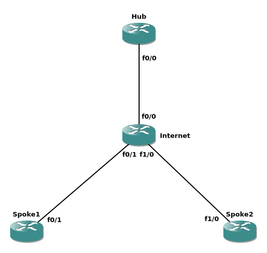

# Overwiew
Supplementary materials for the article about DMVPN mcast spoke-to-spoke deployment on [foxnetlab.com](https://foxnetlab.com/index.php/181-spoke-to-spoke-multicast-in-dmvpn)

# Topology

DMVPN Phase 2 deployment. The goal is to be able to stream multicast from Spoke2 and receive it on Spoke1 as efficiently as possible.
